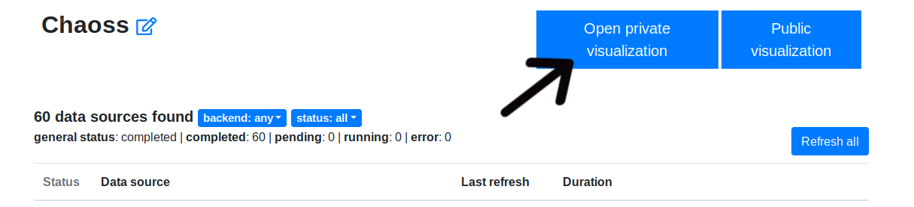
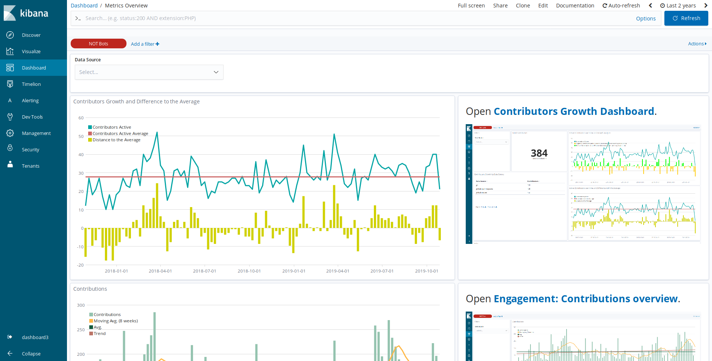
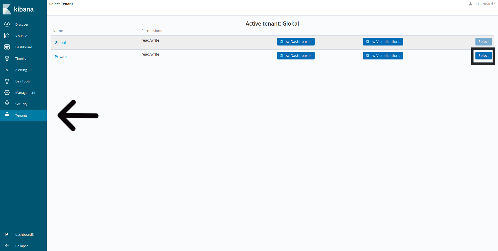
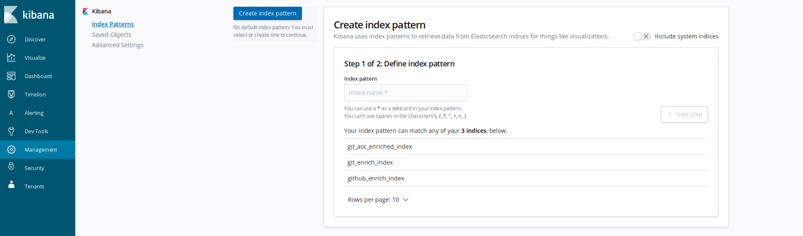
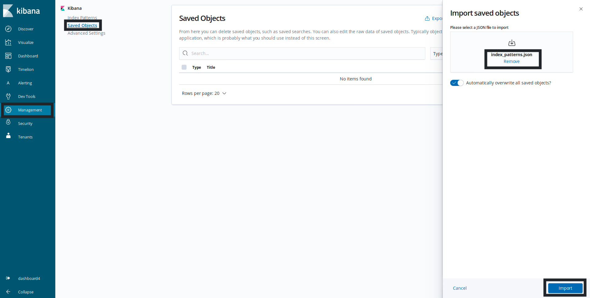
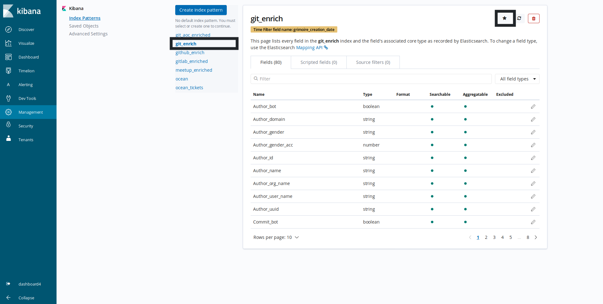
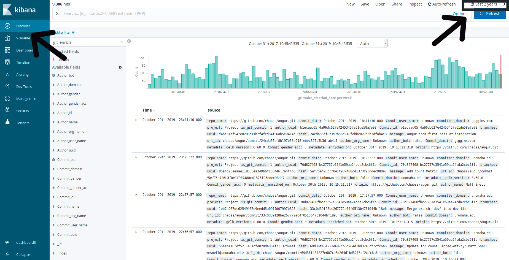

# OpenDistro for Elasticsearch - Kibana

## Open default panels

If you have already analyzed a list of datasources and you want to play with the data in Kibana, you have to click in Open Private Visualization button:

Once Kibana has started, you can see some simple panels that can be extended by opening the links provided:

## Create custom panels

> All the panels created in this mode (private tenant) cannot be shared, but you can access them anytime. We are working on a solution to share these visualizations.

- **Open the private tenant**

  If you want to analyze and play with the data, you can go to the private tenant. For that, click on the `Tenants` tab and select the private tenant:

  

  Now, you will have an empty Kibana with only the data of your projects.

- **Create the index patterns**

  For using the data with Kibana you have to create an index pattern first. Go to `Management` > `Index Patterns` to create yours:

  

  We highly recommend to import the index patterns we have created. For that you will need to:

  Clone or download this repository. Go to `Management` > `Saved Objects` > `Import`, select from this repository the file `cauldron/guides/panels/global/index_patterns.json` and click `Import`.

    

  Finally, you need to select the deault index in `Management` > `Index Patterns`. For example `git_enrich`:

    

- **Play with the data**

  Once you have created the index patterns, you can click on `Discover` tab and select an appropriate Time Range to explore the data you have:

  

  You can access the `Visualize` or the `Dashboard` tab and create your own panels with data.

- **Import panels from global**

  We have created some panels that work with the data in Cauldron. If you want to import them to your private tenant, you have to:
  - Clone or download this repository.
  - Go to `Management` > `Saved Objects` > `Import` and select the file of this repository: `cauldron/guides/panels/global/panels.json`.

  If you want the full Global dashboard in your private tenant, you can import the file `cauldron/guides/panels/global/full_dashboards.json`.
